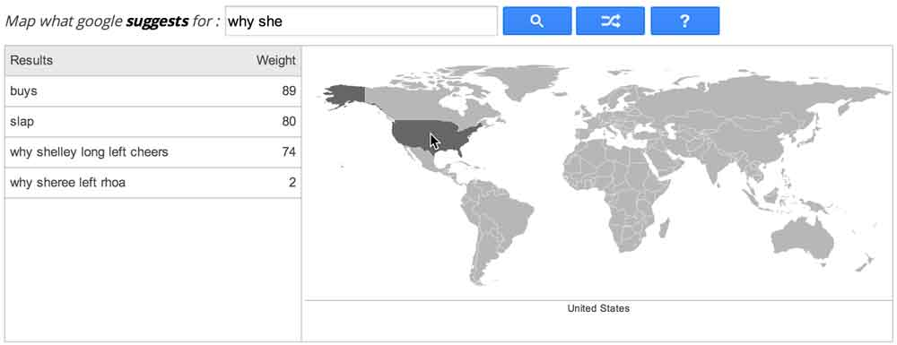
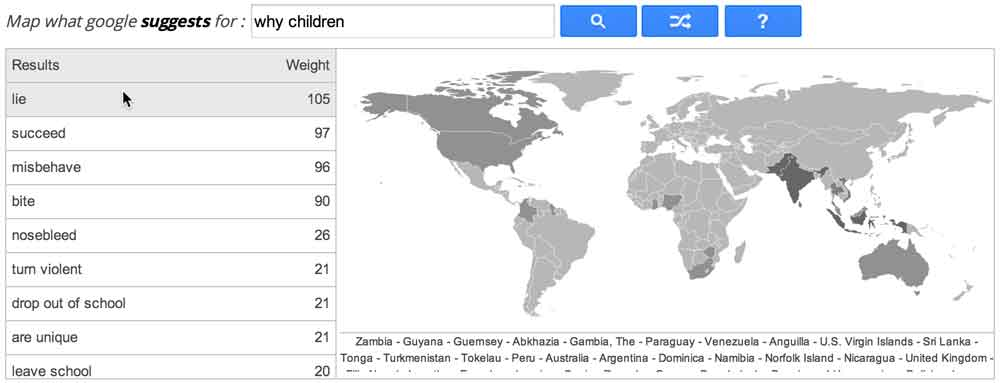

# Zeitgeist Borders

**Zeitgeist Borders enable you to map all google domains specific suggestions over a world map.**

By passing your mouse over a country you get the list of all related suggestions:

By passing your mouse over a suggestion you see all the related countries being highlighted on the map:

This software was developed by [@mazieres](https://github.com/mazieres), [@cybunk](https://github.com/cybunk) and [@sizeof](https://github.com/JulienPalard) at [Fabelier](http://fabelier.org)

# License

This program is free software: you can redistribute it and/or modify
it under the terms of the GNU General Public License as published by
the Free Software Foundation, either version 3 of the License, or
(at your option) any later version.

This program is distributed in the hope that it will be useful,
but WITHOUT ANY WARRANTY; without even the implied warranty of
MERCHANTABILITY or FITNESS FOR A PARTICULAR PURPOSE.  See the
GNU General Public License for more details.

You should have received a copy of the GNU General Public License
along with this program.  If not, see <http://www.gnu.org/licenses/>.

# Installing Zeitgeist Borders

## Dependencies

In order to use Zeitgeist Borders you must have [Python](http://www.python.org/download/releases/2.7/) installed with the following dependencies: 

+ [Pyramid](http://docs.pylonsproject.org/projects/pyramid/en/latest/index.html)
+ [PyMongo](http://api.mongodb.org/python/current/)
+ [Paste](http://pythonpaste.org/)

All of them are available through [`easy_install`](http://pypi.python.org/pypi/setuptools):

	sudo easy_install pyramid
	sudo easy_install pymongo
	sudo easy_install paste

## Installation and usage

Open a terminal and download Zeitgeist Borders:

	git clone git://github.com/fabelier/Zeitgeist-Borders.git

Move to the application's folder:

	cd Zeitgeist-Borders/

Launch the server:

	python ./http.py

Browse the application's page by typing the following address into your Browser:

	http://127.0.0.1:8080/

Enjoy !